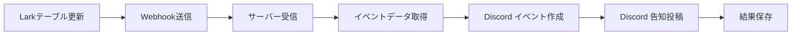

# 🚀 無料サーバーでのLark Webhook自動化デプロイガイド

## 📋 概要

LarkテーブルのWebhookトリガーを使用して、Discord イベント作成と告知を自動化するシステムです。

## 🆓 無料デプロイオプション

### 1. Railway（推奨）

**特徴:**
- 月500時間無料（約20日間稼働）
- GitHub連携で自動デプロイ
- 簡単設定

**デプロイ手順:**

1. **GitHubリポジトリ作成**
   ```bash
   git init
   git add .
   git commit -m "Initial commit"
   git remote add origin https://github.com/yourusername/your-repo.git
   git push -u origin main
   ```

2. **Railway設定**
   - [Railway](https://railway.app)にアクセス
   - GitHubでサインアップ
   - "New Project" → "Deploy from GitHub repo"
   - リポジトリを選択

3. **環境変数設定**
   ```
   DISCORD_BOT_TOKEN=your_discord_bot_token
   DISCORD_GUILD_ID=your_guild_id
   DISCORD_NOTIFICATION_CHANNEL_ID=your_channel_id
   LARK_APP_ID=your_lark_app_id
   LARK_APP_SECRET=your_lark_app_secret
   LARK_TABLE_ID=your_table_id
   ```

4. **デプロイ完了**
   - 自動的にビルド・デプロイ
   - Webhook URL: `https://your-app.railway.app/webhook/lark/event`

### 2. Render

**特徴:**
- 750時間/月無料
- 15分間非アクティブでスリープ

**デプロイ手順:**

1. **Render設定**
   - [Render](https://render.com)にアクセス
   - GitHubでサインアップ
   - "New Web Service"
   - リポジトリを選択

2. **設定**
   ```
   Build Command: pip install -r requirements.txt
   Start Command: python -m uvicorn src.webhook.app:webhook_app.app --host 0.0.0.0 --port $PORT
   ```

3. **環境変数設定**（Railway と同じ）

### 3. Vercel（サーバーレス）

**特徴:**
- 完全無料（制限内）
- サーバーレス関数
- 瞬時起動

**設定ファイル作成:**
```python
# api/webhook.py
from src.webhook.app import webhook_app

app = webhook_app.app
```

## 🔧 Lark Webhook設定

### 1. Lark開発者コンソール

1. **アプリ設定**
   - [Lark Developer Console](https://open.larksuite.com/app)
   - アプリを選択
   - "Event Subscriptions" → "Configure"

2. **Webhook URL設定**
   ```
   https://your-app.railway.app/webhook/lark/event
   ```

3. **イベント購読**
   ```
   - application.table.record.created
   - application.table.record.updated
   ```

### 2. テーブル設定

1. **Webhook有効化**
   - Larkテーブルを開く
   - "自動化" → "Webhook"
   - URLを設定: `https://your-app.railway.app/webhook/lark/event`

2. **トリガー条件**
   ```
   - レコード作成時
   - レコード更新時（特定フィールド）
   ```

## 🔄 自動化フロー



## 📊 監視とログ

### Railway
- ダッシュボードでログ確認
- メトリクス監視

### Render
- ログストリーム
- アラート設定

### ヘルスチェック
```
GET https://your-app.railway.app/health
```

## 🛠️ トラブルシューティング

### よくある問題

1. **Webhook受信できない**
   - URL確認
   - SSL証明書確認
   - ファイアウォール設定

2. **Discord API エラー**
   - Bot権限確認
   - レート制限確認
   - トークン有効性確認

3. **Lark API エラー**
   - アプリ権限確認
   - テーブルアクセス権確認

### ログ確認
```bash
# Railway
railway logs

# Render
# ダッシュボードでログ確認
```

## 💡 最適化のヒント

1. **コスト削減**
   - 不要なログ削減
   - 効率的なAPI呼び出し

2. **パフォーマンス**
   - 非同期処理活用
   - キャッシュ活用

3. **信頼性**
   - エラーハンドリング強化
   - リトライ機能追加

## 🔐 セキュリティ

1. **環境変数**
   - 機密情報は環境変数で管理
   - .envファイルをgitignoreに追加

2. **Webhook検証**
   - 署名検証実装（推奨）
   - IP制限（可能であれば）

## 📞 サポート

問題が発生した場合:
1. ログを確認
2. 環境変数を確認
3. Webhook URLを確認
4. Discord/Lark権限を確認